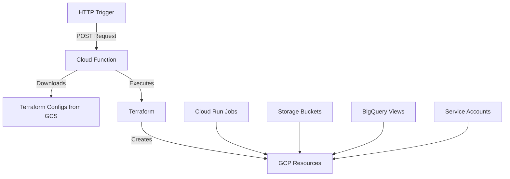

# 🌐 Multi-Connector Infrastructure with Cloud Function Terraform Provisioning

This project automates the provisioning of GCP resources for user integrations (Xero, Shopify, etc.) using Terraform executed via Cloud Functions. Resources are created automatically when a new connection is established.

## 📋 Table of Contents

- [✨ Introduction](#-introduction)
- [🎯 Goals](#-goals)
- [🏗️ Architecture Overview](#️-architecture-overview)
- [⚙️ Key Components](#️-key-components)
- [🚀 Getting Started](#-getting-started)
- [🔧 Usage](#-usage)
- [🔒 Security](#-security)
- [❓ Troubleshooting](#-troubleshooting)
- [📚 Resources](#-resources)

## ✨ Introduction

This infrastructure project automates the creation and management of GCP resources for user integrations. It uses a Cloud Function to execute Terraform configurations that provision resources based on HTTP triggers, managing resources like Cloud Run jobs, Storage buckets, and BigQuery access.

## 🎯 Goals

- HTTP-triggered resource provisioning
- Secure resource isolation per user
- Automated Cloud Run job management
- BigQuery access control per user
- Scalable multi-connector architecture

## 🏗️ Architecture Overview



## ⚙️ Key Components

### Project Structure
```
├── functions/
│   ├── main.py              # Cloud Function implementation
│   └── requirements.txt     # Python dependencies
│
└── infrastructure/
    └── terraform/
        ├── main.tf          # Main Terraform configuration
        ├── outputs.tf       # Root outputs
        ├── variables.tf     # Root variables
        └── modules/
            ├── user_resources/
            │   ├── main.tf
            │   ├── outputs.tf
            │   └── variables.tf
            ├── connector_resources/
            │   ├── main.tf
            │   ├── outputs.tf
            │   └── variables.tf
            └── bigquery_access/
                ├── main.tf
                ├── outputs.tf
                └── variables.tf
```

### Resource Naming Conventions
- Cloud Run Jobs: `{sanitized-user-id}-{connector-type}-{ingestion|transformation}`
- Storage Buckets: `{sanitized-user-id}-{connector-type}`
- BigQuery Views Dataset: `{sanitized-user-id}_views`
- Container Images: `gcr.io/PROJECT_ID/{connector-type}-{ingestion|transformation}:latest`

## 🚀 Getting Started

### 1. Enable Required APIs
```bash
gcloud services enable \
    cloudfunctions.googleapis.com \
    run.googleapis.com \
    cloudbuild.googleapis.com \
    artifactregistry.googleapis.com \
    firestore.googleapis.com \
    cloudscheduler.googleapis.com \
    containerregistry.googleapis.com \
    cloudbilling.googleapis.com \
    iam.googleapis.com \
    cloudresourcemanager.googleapis.com \
    bigquery.googleapis.com \
    storage-api.googleapis.com \
    storage-component.googleapis.com
```

### 2. Create and Configure Service Account
```bash
# Create service account
export PROJECT_ID=$(gcloud config get-value project)
export SA_EMAIL="terraform-sa@${PROJECT_ID}.iam.gserviceaccount.com"

gcloud iam service-accounts create terraform-sa \
    --display-name="Terraform Service Account"

# Grant required roles
for role in bigquery.admin storage.admin iam.serviceAccountAdmin run.admin cloudscheduler.admin datastore.user artifactregistry.admin
do
  gcloud projects add-iam-policy-binding $PROJECT_ID \
    --member="serviceAccount:${SA_EMAIL}" \
    --role="roles/$role"
done

# Get project number for Cloud Run Service Agent setup
export PROJECT_NUMBER=$(gcloud projects describe $PROJECT_ID --format='value(projectNumber)')

# Grant Cloud Run Service Agent permissions
gcloud projects add-iam-policy-binding $PROJECT_ID \
    --member="serviceAccount:service-${PROJECT_NUMBER}@serverless-robot-prod.iam.gserviceaccount.com" \
    --role="roles/artifactregistry.reader"

gcloud projects add-iam-policy-binding $PROJECT_ID \
    --member="serviceAccount:service-${PROJECT_NUMBER}@serverless-robot-prod.iam.gserviceaccount.com" \
    --role="roles/storage.objectViewer"
```

### 3. Prepare Container Images
```bash
# Build and tag connector images (example for Xero connector)
docker build -t xero-ingestion:latest ./connectors/xero/ingestion
docker build -t xero-transformation:latest ./connectors/xero/transformation

# Tag for GCR
docker tag xero-ingestion:latest gcr.io/${PROJECT_ID}/xero-ingestion:latest
docker tag xero-transformation:latest gcr.io/${PROJECT_ID}/xero-transformation:latest

# Configure docker for GCR
gcloud auth configure-docker

# Push images to GCR
docker push gcr.io/${PROJECT_ID}/xero-ingestion:latest
docker push gcr.io/${PROJECT_ID}/xero-transformation:latest

# Verify images
gcloud container images list --repository=gcr.io/${PROJECT_ID}
```

### 4. Initialize Storage and Upload Terraform Files
```bash
# Create and configure GCS bucket
gsutil mb -l us-central1 gs://semantc-terraform-configs
gsutil -m cp -r infrastructure/terraform/* gs://semantc-terraform-configs/
```

### 5. Deploy Cloud Function
```bash
gcloud functions deploy provision-connector \
    --gen2 \
    --runtime=python39 \
    --region=us-central1 \
    --source=./functions \
    --entry-point=provision_connector \
    --service-account=terraform-sa@${PROJECT_ID}.iam.gserviceaccount.com \
    --trigger-http \
    --allow-unauthenticated \
    --memory=2048MB \
    --timeout=540s
```

## 🔧 Usage

### Testing Deployment
```bash
# Test with specific connector type
curl -X POST \
  -H "Content-Type: application/json" \
  -d '{"userId":"USER_ID","connectorType":"xero"}' \
  https://us-central1-${PROJECT_ID}.cloudfunctions.net/provision-connector

# Monitor logs
gcloud functions logs read provision-connector --region=us-central1
```

### Managing Resources
```bash
# List Cloud Run jobs
gcloud run jobs list --region=us-central1

# Delete a job if needed
gcloud run jobs delete JOB_NAME --region=us-central1 --quiet

# List container images
gcloud container images list --repository=gcr.io/${PROJECT_ID}

# Delete container image
gcloud container images delete gcr.io/${PROJECT_ID}/CONNECTOR_TYPE-ingestion:latest --quiet
gcloud container images delete gcr.io/${PROJECT_ID}/CONNECTOR_TYPE-transformation:latest --quiet
```

## 🔒 Security

### Service Account Permissions
- The Terraform service account uses the principle of least privilege
- Each resource type has specific IAM roles assigned
- Service account key management is handled by Cloud Function environment

### Resource Isolation
- Resources are isolated per user using unique identifiers
- Storage buckets use uniform bucket-level access
- BigQuery access is controlled through authorized views
- Cloud Run jobs run with dedicated service accounts

### Access Control
- Cloud Function uses authenticated endpoints
- Container image access is restricted to specific service accounts
- BigQuery datasets implement row-level security
- Storage buckets implement object-level ACLs

### Credential Management
- OAuth tokens are encrypted before storage
- Refresh tokens are managed securely
- Access tokens are rotated automatically
- Credentials are stored in separate Firestore collections

## ❓ Troubleshooting

### Permission Issues
```bash
# Check Terraform service account roles
gcloud projects get-iam-policy $PROJECT_ID \
    --flatten="bindings[].members" \
    --format='table(bindings.role)' \
    --filter="bindings.members:$SA_EMAIL"

# Check Cloud Run Service Agent permissions
gcloud projects get-iam-policy $PROJECT_ID \
    --flatten="bindings[].members" \
    --format='table(bindings.role)' \
    --filter="bindings.members:service-${PROJECT_NUMBER}@serverless-robot-prod.iam.gserviceaccount.com"

# Verify bucket permissions
gsutil iam get gs://semantc-terraform-configs
```

### Container Image Issues
```bash
# List available images
gcloud container images list --repository=gcr.io/${PROJECT_ID}

# Check image details
gcloud container images describe gcr.io/${PROJECT_ID}/CONNECTOR_TYPE-ingestion:latest

# Verify image permissions
gcloud container images get-iam-policy gcr.io/${PROJECT_ID}/CONNECTOR_TYPE-ingestion:latest

# Check Cloud Run job logs
gcloud run jobs execute JOB_NAME --region=us-central1
gcloud logging read "resource.type=cloud_run_job"
```

### Cloud Function Issues
```bash
# View function logs
gcloud functions logs read provision-connector --region=us-central1

# Check function status
gcloud functions describe provision-connector --region=us-central1

# Verify function deployment
gcloud functions list --region=us-central1
```

### Terraform State Issues
```bash
# Check state file existence
gsutil ls gs://semantc-terraform-configs/

# Verify state file permissions
gsutil iam get gs://semantc-terraform-configs

# Check state file content
gsutil cat gs://semantc-terraform-configs/terraform.tfstate
```

## 📚 Resources

### Google Cloud Documentation
- [Cloud Functions Documentation](https://cloud.google.com/functions/docs)
- [Cloud Run Jobs Documentation](https://cloud.google.com/run/docs/create-jobs)
- [Container Registry Documentation](https://cloud.google.com/container-registry/docs)
- [BigQuery Documentation](https://cloud.google.com/bigquery/docs)
- [Cloud Storage Documentation](https://cloud.google.com/storage/docs)
- [Identity and Access Management](https://cloud.google.com/iam/docs)

### Terraform Resources
- [Terraform GCP Provider](https://registry.terraform.io/providers/hashicorp/google/latest/docs)
- [Terraform Cloud Run Resources](https://registry.terraform.io/providers/hashicorp/google/latest/docs/resources/cloud_run_v2_job)
- [Terraform BigQuery Resources](https://registry.terraform.io/providers/hashicorp/google/latest/docs/resources/bigquery_dataset)
- [Terraform Storage Resources](https://registry.terraform.io/providers/hashicorp/google/latest/docs/resources/storage_bucket)

### Additional Resources
- [Docker Documentation](https://docs.docker.com/)
- [OAuth 2.0 Documentation](https://oauth.net/2/)
- [Python Cloud Functions](https://cloud.google.com/functions/docs/concepts/python-runtime)