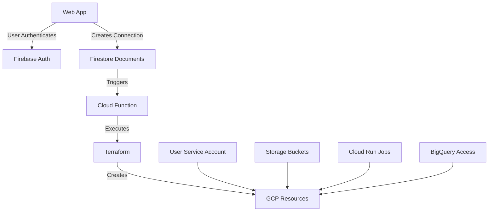

# 🌐 Multi-Connector Infrastructure

This project automates the provisioning of GCP resources for user integrations (Xero, Shopify, etc.) using Terraform. Resources are created automatically when a new connection is established through the web application.

## 📋 Table of Contents

- [✨ Introduction](#-introduction)
- [🎯 Goals](#-goals)
- [🏗️ Architecture Overview](#️-architecture-overview)
- [⚙️ Key Components](#️-key-components)
- [🚀 Getting Started](#-getting-started)
- [🔧 Usage](#-usage)
- [🔒 Security](#-security)
- [❓ Troubleshooting](#-troubleshooting)
- [📚 Resources](#-resources)

## ✨ Introduction

This infrastructure project automates the creation and management of GCP resources for user integrations. It uses Terraform to provision resources based on Firestore documents created by the web application when users connect to services like Xero or Shopify.

## 🎯 Goals

- Automatic resource provisioning triggered by user connections
- Secure credential management using Firestore
- Isolated resources per user
- Scalable multi-connector support
- Cost-effective shared infrastructure where appropriate

## 🏗️ Architecture Overview



Key workflow:
1. User connects via web app
2. Firestore documents created:
   - `/users/{userId}/integrations/connectors`
   - `/users/{userId}/integrations/credentials`
3. Cloud Function triggered
4. Terraform provisions resources

## ⚙️ Key Components

### Firestore Structure
```
/users/{userId}/
├── integrations/
    ├── connectors/
    │   ├── active: boolean
    │   ├── updatedAt: timestamp
    │   └── {connector}:
    │       ├── active: boolean
    │       ├── tenantId: string
    │       ├── tenantName: string
    │       └── updatedAt: timestamp
    └── credentials/
        └── {connector}:
            ├── accessToken: string
            ├── refreshToken: string
            ├── expiresAt: number
            ├── tokenType: string
            ├── scope: string
            └── lastUpdated: timestamp
```

### Resource Naming Conventions
- Service Account: `{userId}-sa`
- Storage Bucket: `{userId}-{connector}`
- Cloud Run Jobs: 
  - `{userId}-{connector}-ingestion`
  - `{userId}-{connector}-transformation`
- BigQuery Tables: `{userId}__{connector}__{entity}`

## 🚀 Getting Started

### Prerequisites

- GCP Project
- Enabled APIs:
  ```bash
  gcloud services enable \
    cloudfunction.googleapis.com \
    cloudbuild.googleapis.com \
    run.googleapis.com \
    bigquery.googleapis.com \
    storage.googleapis.com \
    firestore.googleapis.com \
    cloudscheduler.googleapis.com
  ```

### Initial Setup

1. **Create Service Account**
```bash
export PROJECT_ID="your-project-id"

# Create Terraform service account
gcloud iam service-accounts create terraform-sa \
    --display-name="Terraform Service Account"

# Assign necessary roles
for role in storage.admin cloudscheduler.admin run.admin bigquery.dataEditor iam.serviceAccountCreator secretmanager.admin datastore.viewer
do
  gcloud projects add-iam-policy-binding $PROJECT_ID \
    --member="serviceAccount:terraform-sa@$PROJECT_ID.iam.gserviceaccount.com" \
    --role="roles/$role"
done

# Create and download key
gcloud iam service-accounts keys create terraform-sa-key.json \
    --iam-account=terraform-sa@$PROJECT_ID.iam.gserviceaccount.com
```

2. **Create Storage Bucket for Terraform State**
```bash
gsutil mb gs://terraform-state-$PROJECT_ID
```

3. **Deploy Cloud Function**
```bash
# Create Cloud Function directory
mkdir -p functions/provision-connector
cd functions/provision-connector

# Deploy function
gcloud functions deploy provision-connector \
    --runtime python39 \
    --trigger-event providers/cloud.firestore/eventTypes/document.create \
    --trigger-resource "projects/$PROJECT_ID/databases/(default)/documents/users/{userId}/integrations/connectors"
```

## 🔧 Usage

### Project Structure
```
.
├── terraform/
│   ├── main.tf              # Main configuration
│   ├── variables.tf         # Variable definitions
│   ├── outputs.tf          # Output definitions
│   └── modules/
│       ├── user_resources/  # User service account, IAM
│       ├── connector_resources/  # Connector-specific resources
│       └── bigquery_access/  # Table permissions
├── functions/
│   └── provision-connector/
│       ├── main.py          # Cloud Function code
│       ├── requirements.txt
│       └── terraform/       # Terraform files for function
└── .gitignore
```

### Deployment Process

1. **Initialize Terraform:**
```bash
cd terraform
terraform init
```

2. **Test Configuration:**
```bash
terraform plan -var-file=example.tfvars
```

3. **Monitor Deployments:**
```bash
# View Cloud Function logs
gcloud functions logs read provision-connector

# List resources
gcloud run jobs list
gsutil ls
bq ls
```

## 🔒 Security

- One service account per user
- Least privilege access
- Resources isolated by user ID
- Credentials stored in Firestore
- Table-level access control in BigQuery

## ❓ Troubleshooting

### Common Issues

1. **Permissions:**
```bash
# Verify service account roles
gcloud projects get-iam-policy $PROJECT_ID \
    --flatten="bindings[].members" \
    --format='table(bindings.role)' \
    --filter="bindings.members:terraform-sa"
```

2. **Cloud Function Logs:**
```bash
gcloud functions logs read provision-connector --limit=50
```

3. **Resource Verification:**
```bash
# List user's Cloud Run jobs
gcloud run jobs list --filter="metadata.name ~ ^{userId}"

# List user's buckets
gsutil ls -p $PROJECT_ID

# Check BigQuery permissions
bq show --format=prettyjson raw_data
```

## 📚 Resources

- [Terraform GCP Provider](https://registry.terraform.io/providers/hashicorp/google/latest/docs)
- [Cloud Functions Documentation](https://cloud.google.com/functions/docs)
- [Firestore Documentation](https://cloud.google.com/firestore/docs)
- [Cloud Run Jobs](https://cloud.google.com/run/docs/create-jobs)

Would you like me to expand on any section or add additional information?