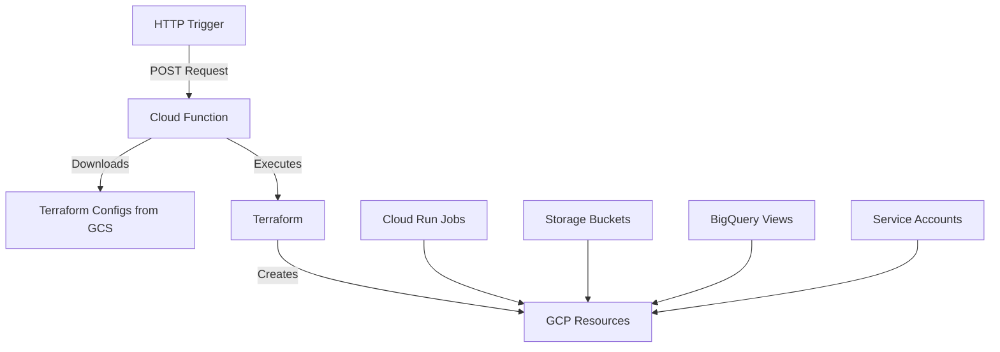

# 🌐 Multi-Connector Infrastructure with Cloud Function Terraform Provisioning

This project automates the provisioning of GCP resources for user integrations (Xero, Shopify, etc.) using Terraform executed via Cloud Functions. Resources are created automatically when a new connection is established.

## 📋 Table of Contents

- [✨ Introduction](#-introduction)
- [🎯 Goals](#-goals)
- [🏗️ Architecture Overview](#️-architecture-overview)
- [⚙️ Key Components](#️-key-components)
- [🚀 Getting Started](#-getting-started)
- [🔧 Usage](#-usage)
- [🔒 Security](#-security)
- [❓ Troubleshooting](#-troubleshooting)
- [📚 Resources](#-resources)

## ✨ Introduction

This infrastructure project automates the creation and management of GCP resources for user integrations. It uses a Cloud Function to execute Terraform configurations that provision resources based on HTTP triggers, managing resources like Cloud Run jobs, Storage buckets, and BigQuery access.

## 🎯 Goals

- HTTP-triggered resource provisioning
- Secure resource isolation per user
- Automated Cloud Run job management
- BigQuery access control per user
- Scalable multi-connector architecture

## 🏗️ Architecture Overview



## ⚙️ Key Components

### Project Structure
```
├── functions/
│   ├── main.py              # Cloud Function implementation
│   └── requirements.txt     # Python dependencies
│
└── infrastructure/
    └── terraform/
        ├── main.tf          # Main Terraform configuration
        ├── outputs.tf       # Root outputs
        ├── variables.tf     # Root variables
        └── modules/
            ├── user_resources/
            │   ├── main.tf
            │   ├── outputs.tf
            │   └── variables.tf
            ├── connector_resources/
            │   ├── main.tf
            │   ├── outputs.tf
            │   └── variables.tf
            └── bigquery_access/
                ├── main.tf
                ├── outputs.tf
                └── variables.tf
```

### Resource Naming Conventions
- Cloud Run Jobs: `{sanitized-user-id}-{connector-type}-{ingestion|transformation}`
- Storage Buckets: `{sanitized-user-id}-{connector-type}`
- BigQuery Views Dataset: `{sanitized-user-id}_views`
- Container Images: `gcr.io/PROJECT_ID/{connector-type}-{ingestion|transformation}:latest`

## 🚀 Getting Started

### 1. Enable Required APIs
```bash
gcloud services enable \
    cloudfunctions.googleapis.com \
    run.googleapis.com \
    cloudbuild.googleapis.com \
    artifactregistry.googleapis.com \
    firestore.googleapis.com \
    cloudscheduler.googleapis.com \
    containerregistry.googleapis.com \
    cloudbilling.googleapis.com \
    iam.googleapis.com \
    cloudresourcemanager.googleapis.com \
    bigquery.googleapis.com \
    storage-api.googleapis.com \
    storage-component.googleapis.com
```

### 2. Create and Configure Service Account
```bash
# Create service account
export PROJECT_ID=$(gcloud config get-value project)
export SA_EMAIL="terraform-sa@${PROJECT_ID}.iam.gserviceaccount.com"

gcloud iam service-accounts create terraform-sa \
    --display-name="Terraform Service Account"

# Grant required roles
for role in bigquery.admin storage.admin iam.serviceAccountAdmin run.admin cloudscheduler.admin datastore.user artifactregistry.admin
do
  gcloud projects add-iam-policy-binding $PROJECT_ID \
    --member="serviceAccount:${SA_EMAIL}" \
    --role="roles/$role"
done

# Grant Cloud Run Service Agent permissions
export PROJECT_NUMBER=$(gcloud projects describe $PROJECT_ID --format='value(projectNumber)')
for role in artifactregistry.reader storage.objectViewer
do
  gcloud projects add-iam-policy-binding $PROJECT_ID \
    --member="serviceAccount:service-${PROJECT_NUMBER}@serverless-robot-prod.iam.gserviceaccount.com" \
    --role="roles/$role"
done
```

### 3. Initialize Storage and Upload Terraform Files
```bash
# Create and configure GCS bucket
gsutil mb -l us-central1 gs://semantc-terraform-configs
gsutil -m cp -r infrastructure/terraform/* gs://semantc-terraform-configs/
```

### 4. Deploy Cloud Function
```bash
gcloud functions deploy provision-connector \
    --gen2 \
    --runtime=python39 \
    --region=us-central1 \
    --source=./functions \
    --entry-point=provision_connector \
    --service-account=terraform-sa@semantc-sandbox.iam.gserviceaccount.com \
    --trigger-http \
    --allow-unauthenticated \
    --memory=2048MB \
    --timeout=540s
```

## 🔧 Usage

### Testing Deployment
```bash
# Test with specific connector type
curl -X POST \
  -H "Content-Type: application/json" \
  -d '{"userId":"qICP2YhF3IbcHfkK6vX2nwXQBhh2","connectorType":"xero"}' \
  https://us-central1-semantc-sandbox.cloudfunctions.net/provision-connector

# Monitor logs
gcloud functions logs read provision-connector --region=us-central1
```

### Managing Resources
```bash
# List Cloud Run jobs
gcloud run jobs list --region=us-central1

# Delete a job if needed
gcloud run jobs delete JOB_NAME --region=us-central1 --quiet
```

## 🔒 Security

- Service account with minimal required permissions
- Resource isolation per user
- BigQuery access controlled via authorized views
- Secure credential management

## ❓ Troubleshooting

### Common Issues

1. **Permission Denied**
```bash
# Check service account roles
gcloud projects get-iam-policy $PROJECT_ID \
    --flatten="bindings[].members" \
    --format='table(bindings.role)' \
    --filter="bindings.members:$SA_EMAIL"
```

2. **Cloud Run Job Issues**
```bash
# List jobs
gcloud run jobs list --region=us-central1

# Check job details
gcloud run jobs describe JOB_NAME --region=us-central1
```

3. **Container Image Access**
```bash
# List available images
gcloud container images list --repository=gcr.io/$PROJECT_ID
```

## 📚 Resources

- [Cloud Functions Documentation](https://cloud.google.com/functions/docs)
- [Cloud Run Jobs Documentation](https://cloud.google.com/run/docs/create-jobs)
- [Terraform GCP Provider](https://registry.terraform.io/providers/hashicorp/google/latest/docs)